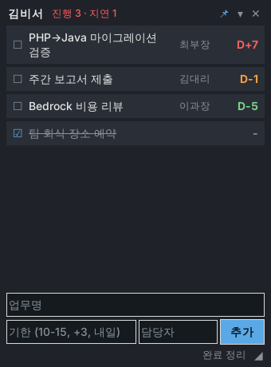

# 김비서 (kimbiseo)

PC 바탕화면에 띄워두는 **업무 스케줄 위젯**. 업무명 · 기한 · 담당자만 적으면 D-Day 순으로 정렬해서 보여준다.



## 실행

Python 3.10+ 만 있으면 된다 (외부 패키지 없음, 표준 라이브러리 `tkinter` 사용).

```bash
# Windows: run.pyw 더블클릭 (콘솔창 없이 실행)
pythonw run.pyw

# 또는
python -m kimbiseo
```

> Windows 시작 시 자동 실행: `Win+R` → `shell:startup` → `run.pyw` 바로가기를 넣는다.

## 사용법

| 동작 | 방법 |
|---|---|
| 업무 추가 | 하단 입력칸 작성 후 `Enter` / `추가` |
| 수정 | 항목 더블클릭 (Esc 취소) |
| 완료 체크 | 왼쪽 ☐ 클릭 |
| 삭제 | 항목 우클릭 → 삭제 |
| 완료 항목 일괄 삭제 | `완료 정리` |
| 이동 / 크기 조절 | 상단 바 드래그 / 우하단 ◢ 드래그 |
| 항상 위 고정 토글 | 📌 |
| 접기 / 펼치기 | ▾ |

**기한 입력 형식**: `2026-10-15`, `2026.10.15`, `10-15`, `10/15`, `+3`(3일 뒤), `오늘`, `내일`, `모레`, 빈칸(기한 없음).
연도 없이 입력한 날짜가 이미 지났으면 다음 해로 처리한다.

**색상**: 지연(빨강) · D-1 이내(주황) · D-3 이내(노랑) · 그 외(초록)

## 데이터

- 저장 위치: Windows `%APPDATA%\kimbiseo\tasks.json`, 그 외 `~/.config/kimbiseo/tasks.json`
- 변경 즉시 저장. 임시 파일에 쓴 뒤 교체(atomic write)하므로 저장 도중 꺼져도 기존 파일은 깨지지 않는다.
- 파일이 손상되어 읽을 수 없으면 덮어쓰지 않고 `tasks.json.corrupt-<시각>` 으로 보관한 뒤 빈 목록으로 시작한다.

## 개발

```bash
pip install -e ".[dev]"
pytest
```

- `kimbiseo/store.py` — 모델 · 기한 파싱 · JSON 저장 (UI 독립, 단위 테스트 대상)
- `kimbiseo/widget.py` — tkinter 위젯
